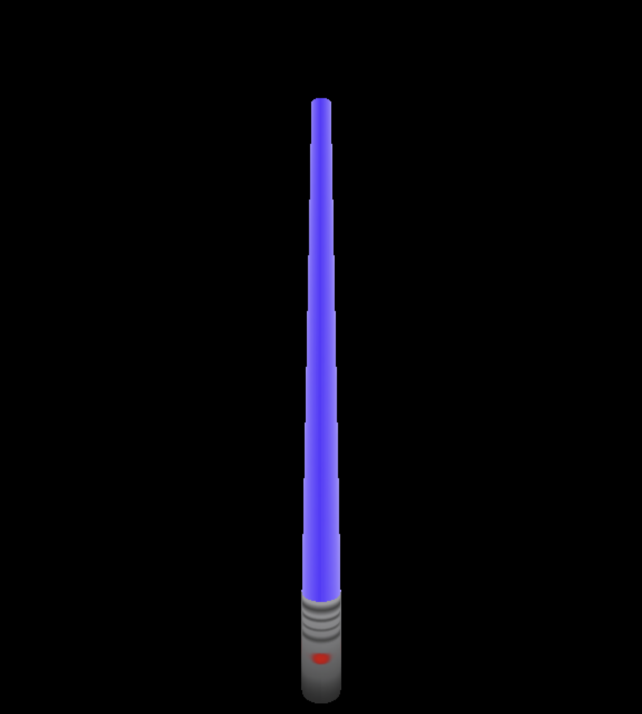

# WebSaber

An experimental game, where you can control a lightsaber using the gryoscope in your mobile phone.

Uses web sockets to communicate gyroscopic orientation data between phone and display.

# Screenshots

